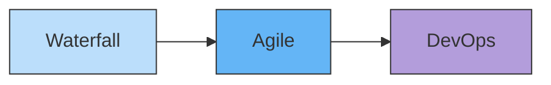
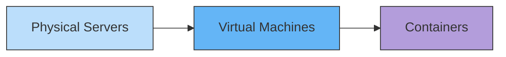

## `Definition`

Application evolution in software development can be seen across three dimensions: **delivery practices**, **system architecture**, and **infrastructure**. Over time, each has shifted toward greater speed, flexibility, and scalability. Together, these shifts illustrate how development has adapted to handle growing complexity, rapid change, and the need for continuous value delivery.

---
## `Key Ideas`

Technology is the enabler of innovation, rather than the driver of innovation. You must have an innovative business idea to leverage technology.

##### ==Delivery==

##### ==Architecture==

##### ==Infrastructure==

---
## `Links`

- [[Delivery]]
- [[Architecture]]
- [[Infrastructure]]
