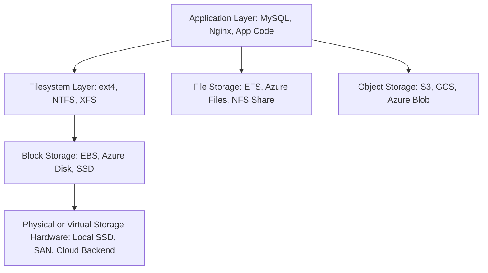

### `Definition`

The storage architecture layer model describes how data moves from an application down to the physical or cloud storage system.  

Each layer abstracts complexity from the one below it — from high-level application logic down to low-level data blocks or distributed storage objects.

---
### `Key Ideas`

- The **application** interacts with the filesystem or APIs, not raw hardware.
    
- The **filesystem** organizes files and directories, mapping them to underlying blocks.
    
- **Block storage** provides raw storage volumes, requiring a filesystem to structure them.
    
- **File storage** already includes a managed filesystem accessible over a network.
    
- **Object storage** replaces the filesystem with an API-based model for massive scalability.

---
### Diagram

Note: Some learning materials treat **DAS** as a “fourth type” just to highlight the **physical vs. networked** difference — especially when introducing students to how storage evolved:

- **DAS →** single machine, local disks (old-school)
    
- **NAS →** file storage over network
    
- **SAN →** block storage over network
    
- **Object Storage →** modern HTTP-based storage

---
### `Connected Notes`

- [[Cloud Storage]]
- [[Storage Variants]]
- [[File Storage]]
- [[Block Storage]]
- [[Object Storage]]