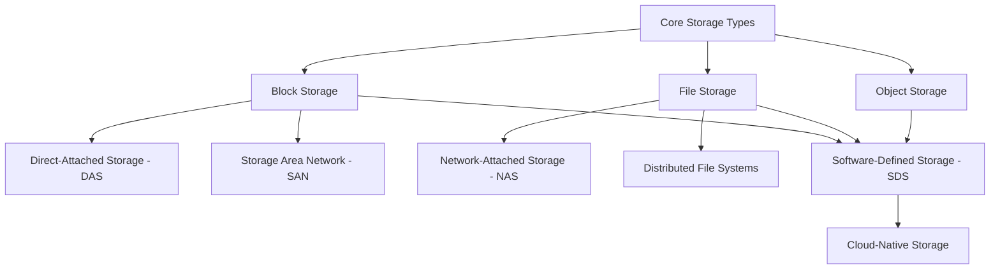

### `Definition`

Storage variants are specialized implementations or extensions of the three core storage types — **block, file, and object storage**.  
They adapt the core models to different environments, scales, and use cases (e.g., physical servers, distributed clusters, or cloud-native systems).

---

### `Key Ideas`

- Each variant **builds upon** one of the core storage types to add functionality like networking, clustering, or abstraction.
    
- **Block-based variants** (like DAS and SAN) focus on how storage is physically or virtually connected to compute nodes.
    
- **File-based variants** (like NAS or distributed file systems) emphasize multi-node access and scalability.
    
- **Cross-type systems** (like SDS or cloud-native storage) abstract or virtualize multiple storage models together.
    
- These variants define how modern systems deploy storage — from single-machine setups to fully virtualized cloud platforms.

---
### `Variants Overview`

| Variant                            | Core Type | Description                                                                          | Common Examples                     |
| ---------------------------------- | --------- | ------------------------------------------------------------------------------------ | ----------------------------------- |
| **Direct-Attached Storage (DAS)**  | Block     | Physical storage directly attached to one machine (e.g., local SSD).                 | Local disks, server HDDs            |
| **Storage Area Network (SAN)**     | Block     | Network of block storage devices accessible by multiple servers.                     | Fibre Channel SAN, iSCSI SAN        |
| **Network-Attached Storage (NAS)** | File      | Shared file storage served over Ethernet using NFS or SMB.                           | Synology NAS, NetApp, AWS EFS       |
| **Distributed File Systems**       | File      | Clustered file storage spread across multiple servers for scale and redundancy.      | HDFS, GlusterFS, Lustre             |
| **Software-Defined Storage (SDS)** | Hybrid    | Virtualized management layer unifying block, file, or object storage across devices. | Ceph, VMware vSAN, OpenStack Cinder |
| **Cloud-Native Storage**           | Hybrid    | Container-optimized abstraction for persistent volumes and dynamic provisioning.     | CSI drivers, Longhorn, OpenEBS      |

---
### `Diagram`

---
### `Connected Notes`

- [[Storage Architecture Layers]]
- [[Direct-Attached Storage (DAS)]]
- [[Storage Area Network (SAN)]]
- [[Network-Attached Storage (NAS)]]
- [[Distributed File Systems]]
- [[Software-Defined Storage (SDS)]]
- [[Cloud-Native Storage]]