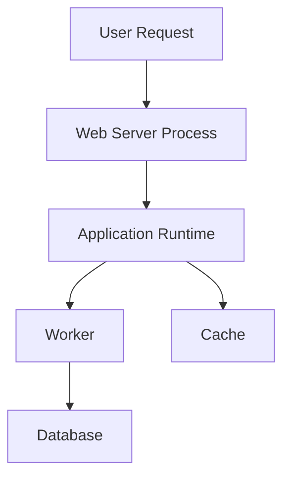

### `Definition`

A **Runtime Diagram** is a **visual representation of how a system behaves while it is running**, showing **components, processes, threads, and their interactions over time**.

It focuses on **execution flow**, not static structure.

---
### `Key Ideas`

- **Runtime vs Design-Time**  
    Runtime diagrams describe **what actually happens during execution**, unlike class or architecture diagrams which show structure at rest.
    
- **Focus on Active Elements**  
    Commonly includes:
    
    - Processes
    - Threads
    - Services
    - Runtime components
    - In-memory interactions
    
- **Interaction-Oriented**  
    Emphasizes:
    
    - Requests and responses
    - Data flow
    - Message passing
    - Execution order
    
- **Time Awareness**  
    Often implies or explicitly shows **sequence over time**, even if not strictly chronological like a sequence diagram.
    
- **Abstraction Level Is Flexible**  
    Can be:
    
    - High-level (services and APIs)
    - Low-level (threads, event loops, runtime instances)
    
- **Used for Understanding Behavior, Not Implementation Details**  
    Helps answer:
    
    - “What talks to what at runtime?”
    - “Where does this request go?”
    - “What is running concurrently?”

---
### `Example`

---
### `Connected Notes`

- [[Architectural Diagrams]]